# Cvičení 1

## Zadání

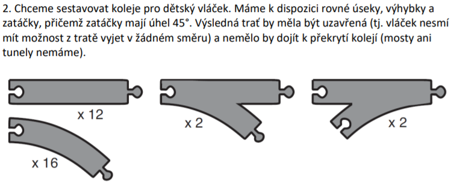

## Řešení

Můj algoritmus pro řešení tohoto problému spočívá v rekurzivním prohledávání stavového prostoru **hrubou silou**. V každém kroku stavby tratě jsou postupně vyzkoušeny všechny **druhy kolejí** (zde max. 4), dokud není nalezeno řešení (příp. dokud nedojdou koleje). Algoritmus dokáže najít **uzavřenou** trať bez **překrývání** kolejí. Poradí si i s **výhybkami**.

K dispozici máme **rovné** (*straight*), **pravotočivé** (*curved*) koleje a dále **výhybky s odbočkou doprava** (*divergent*) a **výhybky s připojením zprava** (*convergent*). Základem pro řešení tohoto problému je přechod ze **spojitého** prostředí do **diskrétního**, a tedy zobrazení kolejí do kartézské soustavy souřadnic. Je důležité si uvědomit, že rovné a pravotočivé koleje jsou již **součástí obou typů výhybek**. Pro rovné koleje byla zvolena velikost 3, pro pravotočivé 2 a výhybky tak vzniknou kombinací předchozích. Vzhledem k tomu, že zatáčky mají úhel 45°, lze se po mřížce pohybovat jak **horizontálně** (příp. **vertikálně**), tak **diagonálně** (tedy v **8 různých úhlech**). Zatáčky kreslím **pouze diagonálně**, avšak rovné úseky kreslím i horizontálně/vertikálně (pro zjednodušení vždy se stejnou velikostí 3).

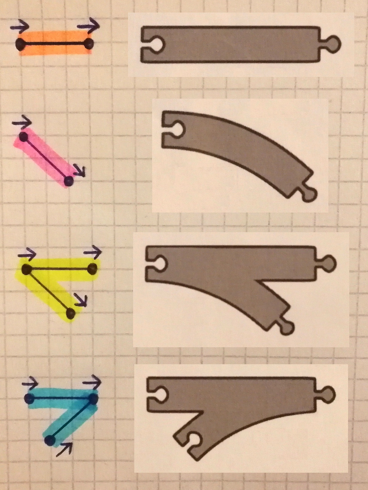

## Spuštění

`py main.py A B C D`

* **A** = počet **rovných** kolejí (*straight*)
* **B** = počet **pravotočivých** kolejí (*curved*)
* **C** = počet **výhybek s odbočkou doprava** (*divergent*)
* **D** = počet **výhybek s připojením zprava** (*convergent*)

## Výstupy

Na každém obrázku je uveden *výstup algoritmu* pro zadaný počet kolejí, *zakreslení tratě do mřížky* a u menších vstupů i *spojitá varianta*. Každý řádek výstupu znamená jednu položenou kolej ve formátu:

`((x, y, úhel) na začátku koleje, (x, y, úhel) na konci koleje, typ koleje)`

Algoritmus vždy začíná na souřadnicích **[0, 0] pod úhlem 0°**. Šipky v mřížce značí jednotlivé **úhly**. K dispozici je také **měření času**.

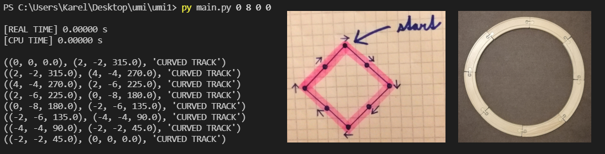
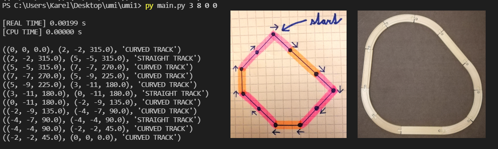
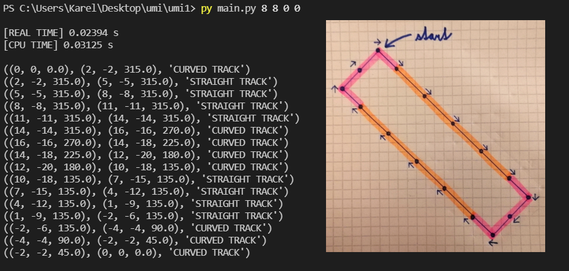

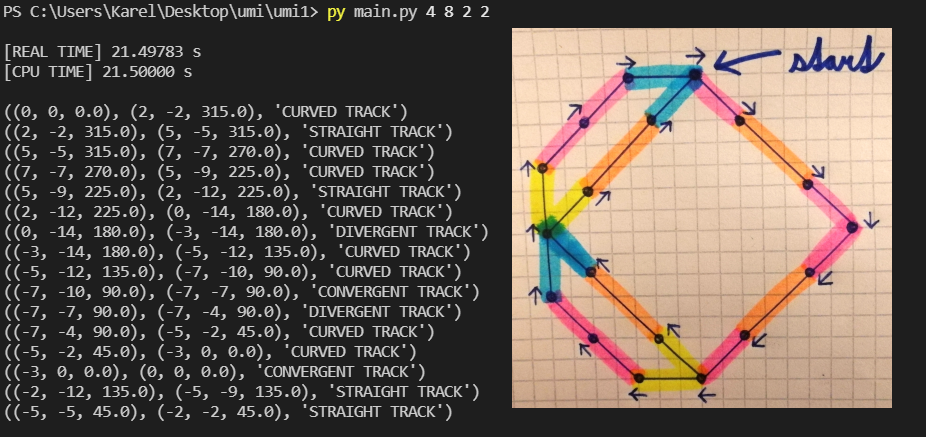
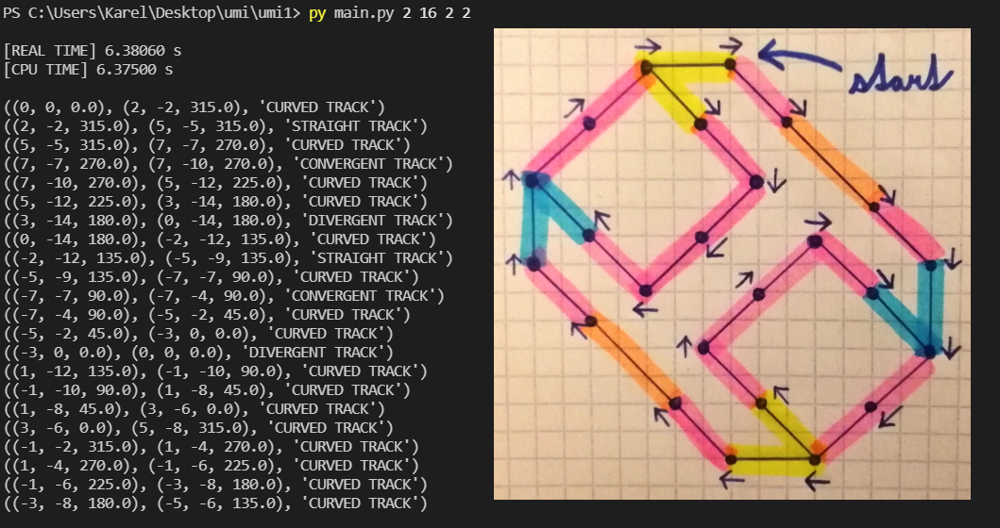

Následuje výstup pro **počty kolejí uvedené v zadání úlohy**. Algoritmu trvalo necelých **5 hodin** pro nalezení tohoto řešení. To svědčí o velké (exponenciální) složitosti prohledávání a nepraktičnosti algoritmu pro velké sady kolejí.

Jako důkaz realizace jsou uvedeny i následující útržky spojité varianty. Bohužel jsem neměl k dispozici dostatečný počet kolejí, avšak pro ukázku snad postačuje.

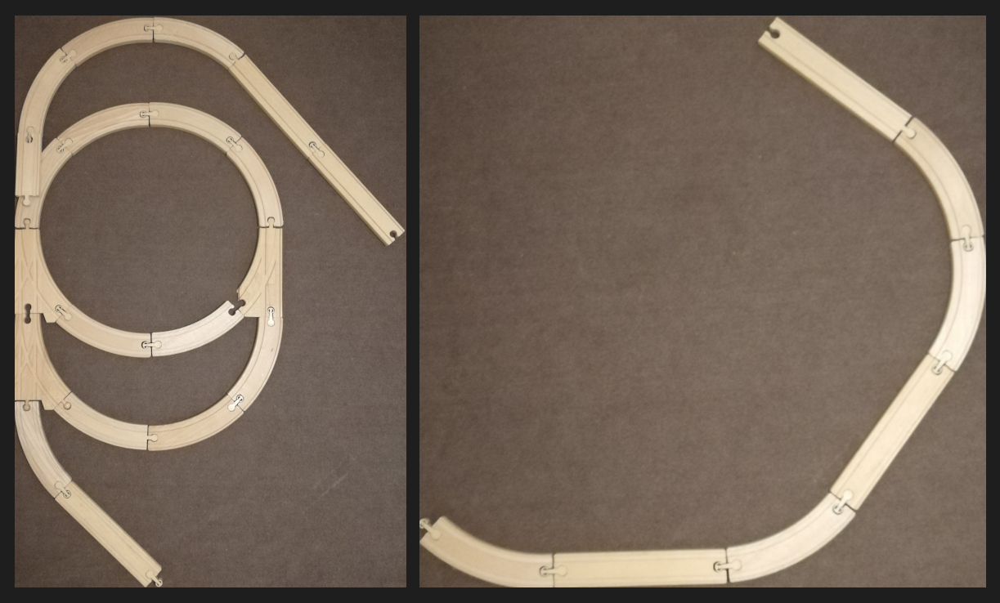

Pro některá zadání však algoritmus řešení nenašel. Například pro 16 pravotočivých kolejí by musel vytvořit dva identické kruhy po 8 kolejích. Proto je toto zadání vyhodnoceno jako **overlapping** (překrývání). 

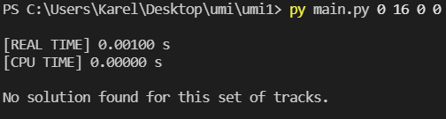

Naopak nedostatek pravotočivých kolejí způsobí **neuzavřenost tratě**. Počet pravotočivých kolejí proto musí být vždy takový, aby se jejich úhly nasčítaly na **velikost 360°** (tedy **minimálně 8**).

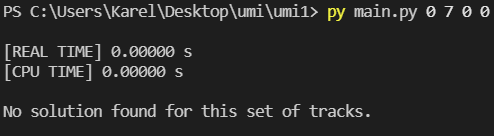

Výhybky způsobují přidání dalšího počátečního bodu (pro stavbu kolejí), pro který však musí existovat i bod koncový (pro napojení). Počet divergentních a konvergentních výhybek tak musí být vždy **roven**, protože jinak riskuji **neuzavřenost tratě**.

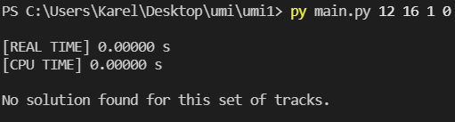
