# Cvičení 2

## Zadání

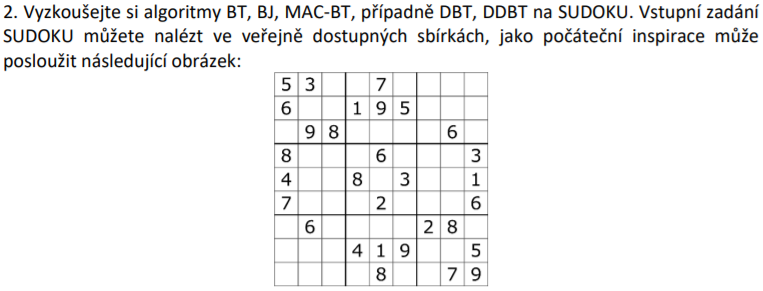

## Řešení

Z výše uvedených algoritmů jsem vypracoval **BT** (*backtracking* včetně *forward checking*), **MAC_BT** (*backtracking* včetně *maintaining arc consistency*), **BJ** (*backjumping*) a **DBT** (*dynamic backtracking*). Jejich implementace se nachází v příslušných souborech ve složce **algorithms**. Při tvorbě jsem se snažil v maximální míře vycházet z pseudokódů uvedených v přednáškách. I přesto jsou v implementaci drobné rozdíly, tudíž jsem celý kód **příslušně okomentoval** pro rychlejší pochopení.

Pro testování jsem použil **8 náhodně vybraných zadání sudoku** rozřazených do různých kategorií obtížnosti (pro člověka). U každé instance byl navíc měřen čas CPU (vzhledem k malému počtu instancí však nelze činit obecné závěry). Níže uvedené výsledky pouze dokumentují **správnost jednotlivých algoritmů**.

## Spuštění

`py main.py ALG [-v]`

* **ALG** = zvolený algoritmus (povolené hodnoty: *BT*, *MAC_BT*, *BJ*, *DBT*)
* **v** = volitelný parametr *verbose* (ve výchozím nastavení jsou veškeré výstupy programu velmi stručné; tento parametr aktivuje obšírnější výstupy rozšířené o *vstupní zadání sudoku*, *výstupní řešení sudoku* a *řešení očekávané*)

## Výstupy

*Backtracking* včetně *Forward Checking*:

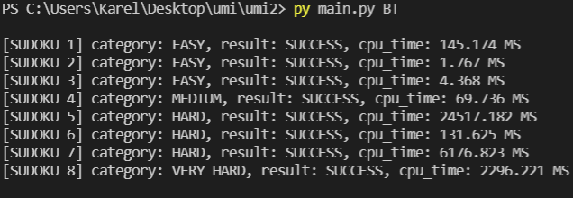

*Backtracking* včetně *Maintaining Arc Consistency*:

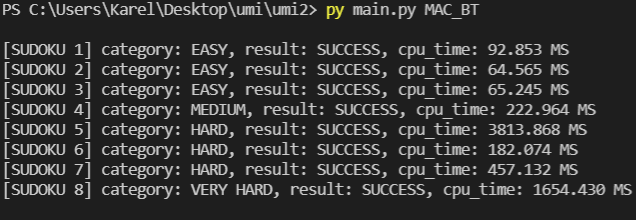

*Backjumping*:

*Dynamic Backtracking*:

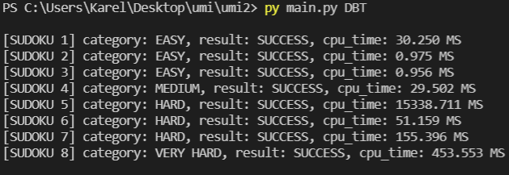

## Použité sudoku a získaná řešení

**SUDOKU 1** (*lehké*):

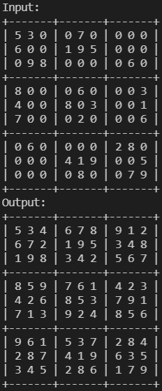

**SUDOKU 2** (*lehké*):

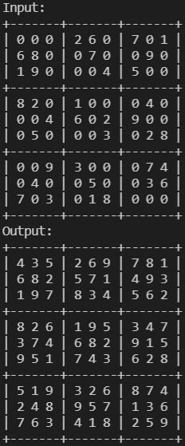

**SUDOKU 3** (*lehké*):

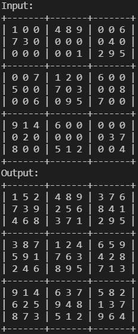

**SUDOKU 4** (*střední*):

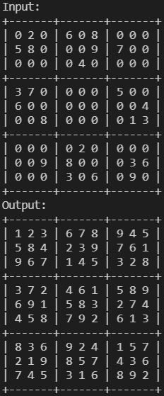

**SUDOKU 5** (*těžké*):

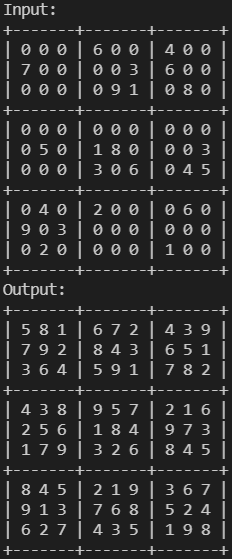

**SUDOKU 6** (*těžké*):

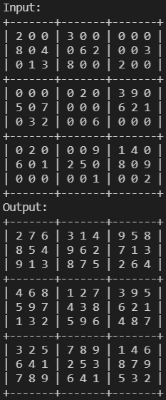

**SUDOKU 7** (*těžké*):

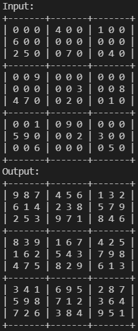

**SUDOKU 8** (*velmi těžké*):

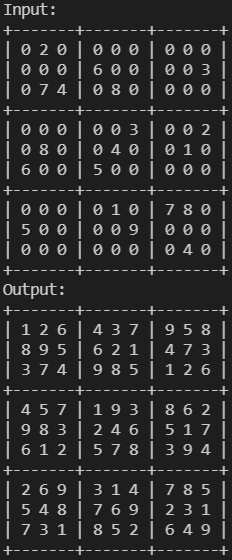
