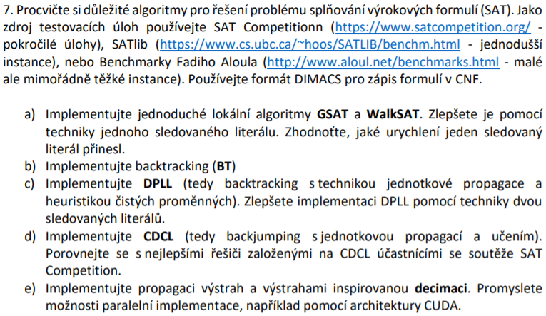
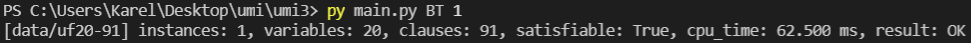
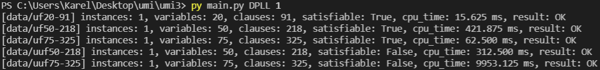
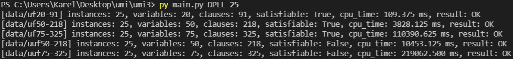
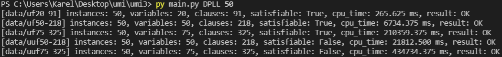

# Cvičení 3

## Zadání

## Řešení

Z výše uvedených algoritmů jsem vypracoval **BT** (*backtracking*) a **DPLL** (*backtracking* s technikou *jednotkové propagace* a heuristikou *čistých proměnných*). Jejich implementace se nachází v příslušných souborech ve složce **algorithms**. Pro testování jsem použil 5 sad testovacích instancí s různými parametry z [tohoto zdroje](https://www.cs.ubc.ca/~hoos/SATLIB/benchm.html). U každé testovací sady byl měřen **čas CPU**. Pro zápis instancí byl použit formát **DIMACS**. 

## Spuštění

`py main.py ALG LIMIT`

* **ALG** = zvolený algoritmus (povolené hodnoty: *BT*, *DPLL*)
* **LIMIT** = zvolený počet testovaných instancí na každou z testovacích sad (povolené hodnoty: *1–50*)

## Výstupy

*BT pro 1 instanci*:

Měření proběhlo pouze pro 1. sadu testovacích dat (z důvodu výpočetní náročnosti).

*DPLL pro 1 instanci*:

Narozdíl od BT používá DPLL techniku *jednotkové propagace*, která významně urychluje výpočet. Dalším vylepšením je heuristika *čistých proměnných*, avšak v testovacích datech se takové proměnné příliš nevyskytují, tudíž má tato heuristika jen nevýznamný efekt.

*DPLL pro 25 instancí*:

*DPLL pro 50 instancí*:

