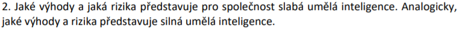

# Cvičení 7

## Zadání

Dobrovolně jsem si vybral úlohu z posledního cvičení.

## Řešení

### Výhody slabé AI

* zlepšení zdravotní péče (např. ve formě přesnějších diagnóz) a digitalizace nejen zdravotnictví
* nové pracovní příležitosti (např. *Machine Learning Engineer*, *Data Scientist*)
* inteligentní budovy (šetření energie, snížení nákladů na provoz, přizpůsobení se počasí, centrální řízení)
* postupný přesun člověka od rutinních ke kreativnějším činnostem
* využívání robotů pro nebezpečnou práci (např. hašení požárů, destrukce výbušných zařízení, válčení s teroristy)
* zmírnění předsudků při přijímání nových zaměstnanců (využíváním čistě analytických dat)
* bezpečnější dopravní prostředky (např. detekce okolních objektů, udržování automobilu mezi čárami, prevence proti usnutí řidiče)
* prevence vůči dezinformacím, kybernetickým útokům a phishingu
* zvýšení výkonu a produktivity různých firem v důsledku používání AI (např. v interních nástrojích)
* automatizace, optimalizace a plynulost prodeje (např. v průmyslu, zemědělství, potravinářství)
* prevence kriminality a teroristických útoků (např. pomocí rozeznávání tváří)

### Rizika slabé AI

* nevyřešená právní stránka (např. komu připadne odpovědnost v případě škody způsobené AI)
* nedostatečné využití a pochopení běžným člověkem (viníkem může být kultura, která povětšinou zobrazuje souboj mezi člověkem a silnou AI, čímž může v široké věřejnosti budovat odpor vůči novým technologiím)
* sledování, rozpoznávání a hodnocení obyvatel (např. *Social Credit System* v Číně)
* falešná videa, audia a obrázky (také *Deepfakes*) mohou vést k poškození subjektů, příp. finančním rizikům
* úbytek velkého počtu pracovních míst (v důsledku automatizace)
* nespravedlivý ekonomický trh (subjekty s větším množstvím dat snadněji eliminují konkurenci)
* manipulace člověka skrze personalizované reklamy (např. v období před volbami)
* opačné použití (např. pro šíření dezinformací, zacílení kybernetických útoků)
* „zlenivění“ člověka, příp. nárůst sebevražd (otázkou je, co lidé udělají s nově nabytou svobodou a časem, které jim AI přinese)
* nehody a havárie (i tak se nejedná o nic dokonalého, může se mýlit, záleží pouze na matematických datech, které ji předáme)

### Výhody silné AI

* obrovský posun ve vědě (nové astronomické objevy, zodpovězení všech složitých otázek a vyřešení všech problémů lidstva)
* pravděpodobně rychlejší dosažení 100% využití energie planety / sluneční soustavy / galaxie (dle *Kardašovovy škály*)
* velký technický a technologický posun (další vynálezy a objevy nových zdrojů energie, příp. *Perpetuum Mobile*)
* pokrok v cestování do vesmíru a osídlování dalších planet
* potenciální přesun člověka od jakékoli činnosti k absolutní svobodě, příp. kontrole této AI

### Rizika silné AI

* ohrožení, příp. vyhynutí lidstva (jeho osud bude potenciálně záviset na jednání této AI, pokud nebudeme mít zajištěnou dostatečnou kontrolu)
* nové války nevídaných rozměrů (v případě, že se tato AI dostane do rukou zločinců, teroristů nebo soupeřících mocností)
* absolutní absence důvěry lidstva ke všemu technickému (vše půjde zmanipulovat)
* ztráta soukromí a pocitu důležitosti (lidé budou vlastně zbyteční)
